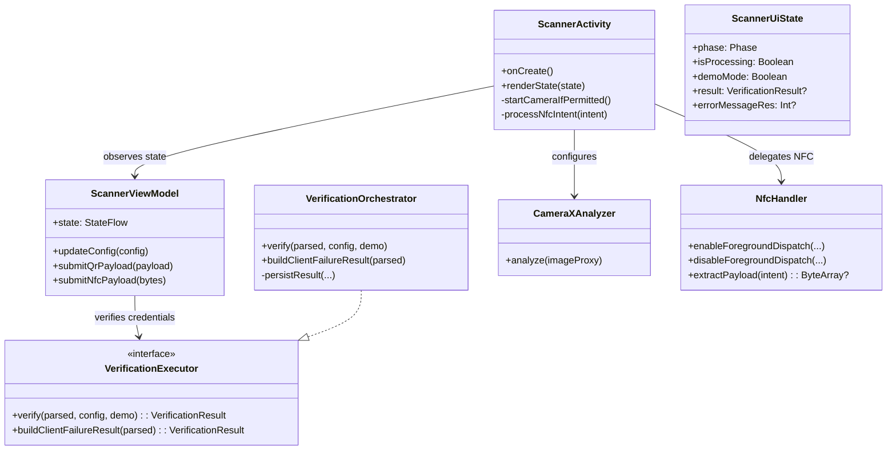

# Scanner Flow Class Diagram

```mermaid
classDiagram
    class ScannerActivity {
        +onCreate()
        +renderState(state)
        -startCameraIfPermitted()
        -processNfcIntent(intent)
    }

    class ScannerViewModel {
        +state: StateFlow<ScannerUiState>
        +updateConfig(config)
        +submitQrPayload(payload)
        +submitNfcPayload(bytes)
    }

    class ScannerUiState {
        +phase: Phase
        +isProcessing: Boolean
        +demoMode: Boolean
        +result: VerificationResult?
        +errorMessageRes: Int?
    }

    class VerificationExecutor {
        <<interface>>
        +verify(parsed, config, demo): VerificationResult
        +buildClientFailureResult(parsed): VerificationResult
    }

    class VerificationOrchestrator {
        +verify(parsed, config, demo)
        +buildClientFailureResult(parsed)
        -persistResult(...)
    }

    class CameraXAnalyzer {
        +analyze(imageProxy)
    }

    class NfcHandler {
        +enableForegroundDispatch(...)
        +disableForegroundDispatch(...)
        +extractPayload(intent): ByteArray?
    }

    ScannerActivity --> ScannerViewModel : observes state
    ScannerActivity --> CameraXAnalyzer : configures
    ScannerActivity --> NfcHandler : delegates NFC
    ScannerViewModel --> VerificationExecutor : verifies credentials
    VerificationOrchestrator ..|> VerificationExecutor
```
